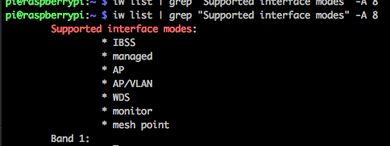

# Wifi-Access-Point-Raspberry-Pi

A Wireless Acces Point to the Ethernet socket, this allows the existing DHCP server to handle that.

- Raspberry Pi v3
- Debian 8
- A Wireless adapter supporting AP mode.

## Requirements

Check the Wireless Interface connected to the Pi can support `AP` 

```bash
iw list | grep "Supported interface modes" -A 8
```


## Packages

```bash
sudo apt-get install -y hostapd bridge-utils
```

## Configuration

Add the bridge configuration to `/etc/network/interfaces` to be a bridged connection to `eth0` (the source of the network)

```bash
auto br0
iface br0 inet static
        bridge_ports eth0
        address 192.168.1.45
        netmask 255.255.255.0
        network 192.168.1.0
        broadcast 192.168.1.255
```

Enable packet forwarding in the kernel

```
sudo sh -c "echo 1 > /proc/sys/net/ipv4/ip_forward"
```
